# ZERO-AR

### The runtime beneath long-horizon work.

Zero-AR is a log-native runtime for long-horizon agent work. It keeps an objective, its evidence, limits, controls and verification state together as work continues across turns, process exits and human waits.

> **The unit is work, not the conversation.**

A model can propose that work is complete. Zero-AR records the proposal and applies the declared validators before the result can be reported as verified. Zero-AR does not decide what correct means. Your task contract and domain validators do.

Zero-AR is not a model, model host, sandbox, chat interface, workflow graph or general domain oracle. This kit does not grant effect authority or decide whether an outside action may occur.

**Developer preview:** this repository contains the nine public integration packages as tested tarballs, emitted JavaScript, TypeScript declarations and the [OpenAPI 3.1 contract](./packages/client/openapi/zero-ar-v1.openapi.json). The packages have not yet been published to npm. The runtime server and bundled Local Lite distribution are separate artifacts.

## Connect to a running endpoint

`ar-kit` is the public surface for building applications, authoring agents and validators, hosting tools, connecting through MCP and controlling Zero-AR work through the native API. Every SDK and command example below needs an already-running Zero-AR endpoint.

```js
import { createZeroAR } from '@zero-ar/sdk';

const zeroar = createZeroAR({
  endpoint: process.env.ZERO_AR_URL,
  apiKey: process.env.ZERO_AR_API_KEY,
});

const run = await zeroar.run({
  objective: 'Examine these records, investigate anomalies and stop only when the totals balance.',
  items: ['record-001', 'record-002', 'record-003'],
});

for await (const record of run.events()) {
  console.log(record.seq, record.type);
}

const result = await run.result();
console.log(result.verdict, result.artifact, result.not_established);
```

A process can discard this handle and recreate it later with `zeroar.attach(runId)`. The runtime owns the run state; the SDK does not keep a second copy.

## Install the recorded artifacts

Node.js 23.6 or later is required. Until the first npm publication, install the exact tested tarballs from a clone:

```bash
git clone https://github.com/zero-ar-labs/ar-kit.git
mkdir zero-ar-first-run && cd zero-ar-first-run
npm init -y
npm install ../ar-kit/release/tarballs/*.tgz

export ZERO_AR_URL=https://your-zero-ar.example
export ZERO_AR_API_KEY=your-tenant-key
./node_modules/.bin/zeroar run "Reconcile the open items and report what remains unverified"
```

The packaged command is an API client. It requires a running hosted or Local Lite endpoint and never falls back after a hosted target has been selected. The application bearer key is separate from model, tool and effect credentials.

## Choose an entry point

| Package | Use it to |
| --- | --- |
| [`@zero-ar/contracts`](./packages/contracts) | Share the schemas, identifiers, state machines and vocabulary of the runtime. |
| [`@zero-ar/client`](./packages/client) | Use the typed native API client or the versioned OpenAPI 3.1 contract. |
| [`@zero-ar/sdk`](./packages/sdk) | Author agents and embed durable run handles in an application. |
| [`@zero-ar/cli`](./apps/cli) | Start, inspect, control, resume, export and import work from the terminal. |
| [`@zero-ar/conformance`](./packages/conformance) | Check an execution-environment adapter against the public contract. |
| [`@zero-ar/tool-kit`](./packages/tool-kit) | Define and host tools against the public tool protocol. |
| [`@zero-ar/mcp`](./packages/mcp) | Expose reviewed work entrypoints and admit bounded MCP tools and resources. |
| [`@zero-ar/testkit`](./packages/testkit) | Exercise integrations with deterministic adapters and isolated scratch state. |
| [`@zero-ar/validator-kit`](./packages/validator-kit) | Author deterministic, grounding and classification validators. |

The typed client and the [OpenAPI 3.1 document](./packages/client/openapi/zero-ar-v1.openapi.json) come from the same route table. The SDK and CLI use that client rather than importing runtime or storage code.

## Runtime shape



The W0 Kernel owns the canonical work log, execution position, budgets, leases and reconstruction. The Quality Plane judges evidence against the task contract. The optional Effect Plane mediates consequential actions, authority, receipts and reconciliation. Models, tools and compute remain replaceable connected services.

## What this repository excludes

This is a source-free public distribution, not the Zero-AR server source tree. It contains no runtime server, storage implementation, provider credential, private package, test fixture or private repository history. Bundled Local Lite is distributed separately, and no command here installs or starts a public server.

MCP is an adapter over the native API. It does not become a second owner of run, quality, effect, artifact or cancellation state.

## Verify the release boundary

Every public tree is generated from one private source commit. The manifest records the digest of every exported file and every package tarball.

```bash
npm run verify
npm run exercise
```

`verify` checks the byte inventory and its binding to source commit `af375a67c9db7bf0541fb9ff2831ce020bb4236a`. `exercise` installs all nine tarballs in an isolated consumer, imports their public entrypoints, reads the OpenAPI contract and runs the packaged command. Neither command publishes anything. See [PROVENANCE.md](./PROVENANCE.md) for the complete boundary.

## License

Apache-2.0. See [LICENSE](./LICENSE) and [NOTICE](./NOTICE).
