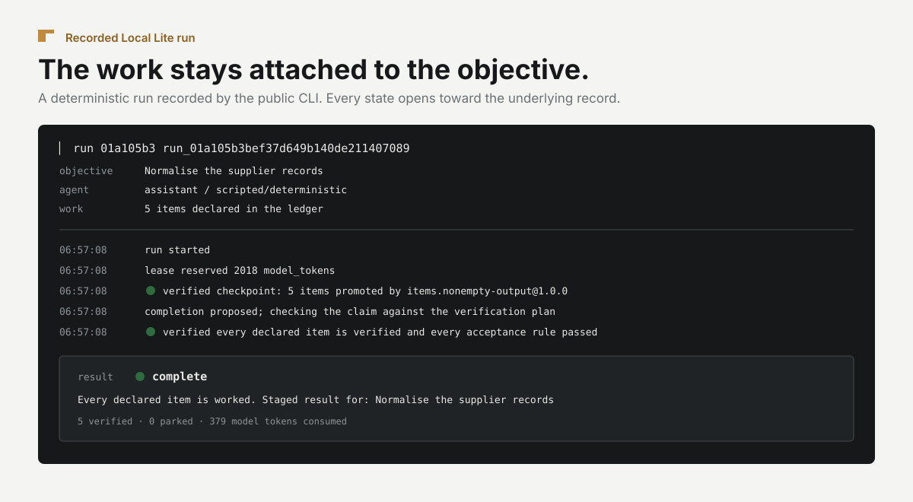
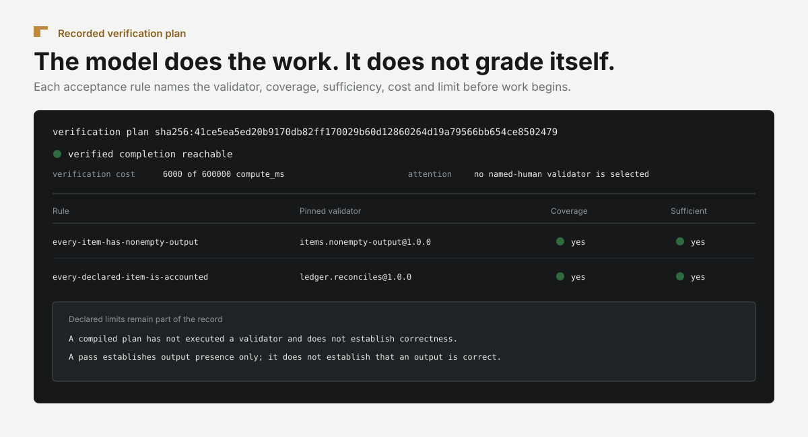
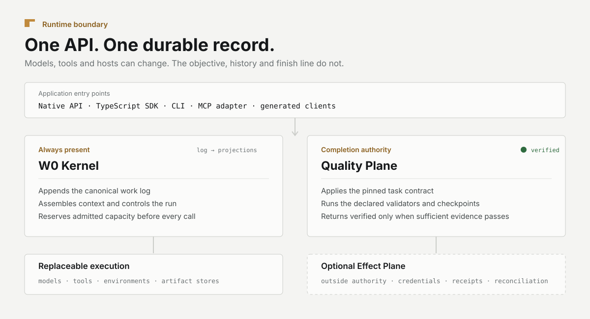

# ZERO-AR

### Zero-layer Autonomous Runtime

**The runtime beneath long-horizon work.**

Zero-AR turns autonomous work into a call: objective in, verified work out. Tell it what to do and what finished means. It keeps autonomous work attached to the objective, not to an agent session. Models and people can change while the objective, its history and its definition of done stay intact.

Agent demos end when an answer appears. Real work ends when the records balance, the evidence covers the claim, the exceptions are resolved and the person who owns the outcome can inspect what happened. Zero-AR owns that longer arc. A run can cross model turns, process exits, human waits and participant changes without replacing its history. Zero-AR continues until it returns a verified result, needs a decision, or states why it cannot finish. It does not invent correctness or grant itself authority.

Zero-AR expands to **Zero-layer Autonomous Runtime**. Zero-layer places the runtime beneath whichever model, agent framework, tool host or human expert does the work. Autonomous Runtime describes continuity toward an explicit objective, not unlimited authority. The product is unrelated to augmented reality or Apple ARKit. `ar-kit` is the public Zero-AR developer kit: the npm packages, their tested tarballs, the API contract and the guides to the release images.



## What you get

| Need | Zero-AR response |
| --- | --- |
| Work that outlives one conversation | A run keeps its objective, position, budgets, controls, evidence and result across restarts, waits and changes of model or person. |
| A definition of done the model cannot rewrite | A task contract binds each acceptance rule to a pinned validator or named human before work begins. Under an open goal the agent writes its own checks, and the result says so. |
| Models and tools without blank authority | No model or tool call starts unless the deployment admitted it and the run's budget covers it. A change to an outside system needs a matching grant. |
| Intervention without starting over | A person can inspect, steer, pause, redirect, answer, resume, cancel and fork the same durable run. |
| A result another system can consume | The HTTP API, typed client, OpenAPI contract, SDK, CLI and MCP adapter all read the same runtime contracts. |
| One machine or a hosted service | Local Lite keeps every run in a `.zero-ar` directory under your project, with one SQLite database. Full Cell serves many tenants over the HTTP API, with PostgreSQL, a key per tenant and a managed secret broker. |

[How Zero-AR works](./docs/how-zero-ar-works.md) explains the terms, what this release includes, what a run guarantees, what Zero-AR does when a problem occurs, what a person can do during a run and the known limits.

## Run Zero-AR

Two public images run the runtime. Each is built for linux/amd64 and linux/arm64.

| Image | Use it when |
| --- | --- |
| `ghcr.io/zero-ar-labs/zero-ar/local-lite:v0.4.1` | One person runs and inspects work on one machine. The entrypoint is the `zeroar` command, and runs stay in `.zero-ar` under the mounted project directory. |
| `ghcr.io/zero-ar-labs/zero-ar/full-cell:v0.4.1` | Applications connect over the network. The cell serves the HTTP API on port 8420, keeps runs in PostgreSQL and gives each tenant its own key. |

With no model settings, Local Lite uses a deterministic adapter, so a first run needs no credential and makes no network call:

```bash
docker run --rm --user "$(id -u):$(id -g)" -v "$PWD:/work" \
  ghcr.io/zero-ar-labs/zero-ar/local-lite:v0.4.1 run "Summarise the objective"
```

[Running Zero-AR](./docs/running-zero-ar.md) covers both images: model provider keys, the Full Cell configuration file, persistent storage, credentials, health and the HTTP API.

A tag can move, so pull by digest for anything you keep. [`release/release-images.json`](./release/release-images.json) names the digest each tag served, and [`release/release-images.json.asc`](./release/release-images.json.asc) signs it with the release key in [`release/zero-ar-release-key.asc`](./release/zero-ar-release-key.asc). Running Zero-AR shows how to check that signature, then pull by digest.

## Build on Zero-AR

**Developer release:** the nine public packages are published to npm at version 0.4.1. This repository also carries their exact tested tarballs, emitted JavaScript, TypeScript declarations and the [OpenAPI 3.1 contract](./packages/client/openapi/zero-ar-v1.openapi.json). The runtime server is not in any package; it ships in the two images.

Every SDK and command example below needs a running Zero-AR endpoint. With the public images, that endpoint is a Full Cell. The Local Lite image keeps its server inside the container, so use its own `zeroar` command for local work.

Node.js 24.11.0 or later in the Node 24 LTS line is required.

### SDK

```bash
npm install @zero-ar/sdk@0.4.1
```

```js
import { createZeroAR } from '@zero-ar/sdk';

const zeroar = createZeroAR({
  endpoint: process.env.ZERO_AR_URL,
  apiKey: process.env.ZERO_AR_API_KEY,
});

const run = await zeroar.run({
  objective: 'Examine these records, investigate anomalies and stop only when the totals balance.',
  items: ['record-001', 'record-002', 'record-003'],
});

for await (const record of run.events()) {
  console.log(record.seq, record.type);
}

const result = await run.result();
console.log(result.verdict, result.artifact, result.not_established);
```

The handle is a client convenience. A process can discard it and recreate it later with `zeroar.attach(runId)`; the runtime owns the run state, and the SDK keeps no second copy. `run.explain()` returns the run's verification plan. The [SDK README](./packages/sdk/README.md) lists the builders for agents, tools, validators, domain packs and publication.

### Client and OpenAPI

```bash
npm install @zero-ar/client@0.4.1
```

The typed client and the [OpenAPI 3.1 document](./packages/client/openapi/zero-ar-v1.openapi.json) come from the same route table, and `@zero-ar/client` exports that document as `@zero-ar/client/openapi`. Generate a client in another language from it; each operation lists the scopes it needs under `x-zero-ar-authorization`. The SDK and CLI use this same client.

### Command line

```bash
npm install --global @zero-ar/cli@0.4.1

export ZERO_AR_URL=https://your-zero-ar.example
export ZERO_AR_API_KEY=your-tenant-key
zeroar run "Reconcile the open items and report what remains unverified"
zeroar inspect run_<id>
zeroar result run_<id> --json
```

The npm command is an API client. It reads the endpoint from `--url` or `ZERO_AR_URL` and the key only from `ZERO_AR_API_KEY`, and a hosted target that refuses never falls back to local execution. The application key authorizes the caller. Model, tool and effect credentials are separate tenant bindings, resolved only when an admitted call needs them; they do not belong in agent manifests, command arguments or model context.

## Choose an entry point

| Package | Use it to |
| --- | --- |
| [`@zero-ar/sdk`](./packages/sdk) | Author agents, tools, validators and domain packs, publish them as immutable closures and attach durable run handles to an application. |
| [`@zero-ar/cli`](./apps/cli) | Publish, run, inspect, control, export and import work from a terminal against a running endpoint. |
| [`@zero-ar/client`](./packages/client) | Call the typed native API, stream durable records and transfer bundles or artifacts. It also exports the OpenAPI 3.1 contract. |
| [`@zero-ar/mcp`](./packages/mcp) | Expose reviewed work entrypoints to MCP clients, or admit bounded MCP tools and resources, without a second owner of the work. |
| [`@zero-ar/contracts`](./packages/contracts) | Share the public schemas, identifiers, state machines, routes and closed vocabularies. |
| [`@zero-ar/tool-kit`](./packages/tool-kit) | Define a typed tool once and host it against the public Tool Host protocol. |
| [`@zero-ar/validator-kit`](./packages/validator-kit) | Author deterministic, grounding and classification validators and exercise them against labelled cases. |
| [`@zero-ar/conformance`](./packages/conformance) | Check an execution-environment adapter against the public lifecycle, or verify and rebuild a portable run bundle without a server. |
| [`@zero-ar/testkit`](./packages/testkit) | Test an integration with a scripted model adapter, a logical clock and scratch directories, with no provider or network. |

Each package directory carries its own README with a first working example.

## What verified means

`Verified` is a result class, not a model's claim that it is done and not a promise that every objective can be verified. Before work begins, the task contract maps each acceptance rule to an admitted validator or named human. The model does the work. It does not grade itself.

An open goal has no task contract. The agent records a plan with checks for each item, and Zero-AR decides whether those checks passed. The result says whether its checks came from an owner contract or the agent's plan, and it names any check the agent revised.

The finish line can be a business outcome rather than a passing test suite: every source record accounted for, totals balanced, exceptions resolved and required approvals or receipts recorded. The first-party validator catalogue and visible verification plan make common conditions reusable. A domain-specific condition can still require its own validator or named human decision. Missing coverage, rejection, failure, timeout or uncertainty cannot become verified.

Zero-AR does not decide what correct means. A weak validator can still check the wrong thing or always return pass. Labelled domain cases and observed false-pass and false-rejection rates are separate evidence.

Read a run's verification plan with `run.explain()` or `zeroar verification-plan run_<id>`. It lists every rule, the validator selected for it, the evidence it needs, its cost, any repair and its stated limits.



Zero-AR is not a model, model host, sandbox, chat interface, workflow graph or general domain oracle. Applications supply objectives and contracts. Deployments supply models, tools, credentials, validators and any authority to affect another system.

## Runtime shape



| Part | What it is responsible for |
| --- | --- |
| W0 Kernel | Always present. Keeps one durable record of the work, assembles context and controls the run. It starts no model or tool call that the run's budget and admitted capabilities do not cover. |
| Quality Plane | Completion authority. Applies the pinned task contract, runs the declared validators and returns verified only when the evidence passes every required rule. |
| Effect Plane | Optional. Holds outside authority, credentials, receipts and reconciliation for changes to outside systems. It is attachable and restricted in the current release. |
| Replaceable execution | Models, tools, environments and artifact stores. Each can change behind the public contracts while the objective, history and finish line stay. |

A restart, an export and import, or a rebuild recreates the same state of a run without calling a model or tool again.

## Completion and action boundaries

### 1. Who defines done?

Your task contract names every acceptance rule and the validator that covers it. Without a contract, the agent's plan names the checks, and the result says so.

### 2. What does Zero-AR enforce?

Zero-AR refuses a rule that no validator covers and a validator that is not registered or does not match the contract. A heuristic finding alone cannot make a rule pass. A result is verified only when every required rule has passed.

### 3. What input does a validator receive?

A validator receives the rule it checks, the work items and outputs that the rule covers, and the total it must account for. A finding about other inputs, or about another number of items, does not count.

### 4. Where does a validator run today?

A validator runs apart from the agent, and the agent cannot change its findings or the run's history. The current validator host is not yet the production isolation boundary.

### 5. What happens when validation cannot conclude?

A missing validator, a crash, a timeout, a cancellation, a failed dependency or a mismatch with its input is reported as indeterminate, never as a pass.

### 6. Can a weak validator establish a useful result?

Not by runtime mechanics alone. A validator can be deterministic and consistently wrong. Use positive, negative, indeterminate and adversarial labelled cases, then measure domain false-pass and false-rejection rates.

### 7. When is the Effect Plane required?

Read-only work may omit it. A change to an outside system needs an attached Effect Plane and a matching grant, and Zero-AR reports the change as done only with the target's receipt. The current release records each proposal and refuses general production dispatch. The one exception is a configured reversible HTTP target whose exact operation, reversal and active grants all match. This kit exports no effect dispatcher or production target adapter.

Before production use, a validator still needs a fixed identity, repeatable results, declared full, sampled or oracle coverage, a complete set of labelled cases, and a host with no network access and fixed resource limits. The current release does not provide that.

## What this repository excludes

This is a source-free public distribution, not the Zero-AR server source tree. It contains no runtime server, storage implementation, provider credential, private package, test fixture or private repository history. The runtime ships as the two public images that [Running Zero-AR](./docs/running-zero-ar.md) describes, and no package here contains or starts it.

MCP clients reach the same runs through the native API. MCP holds no run, verification, effect, artifact or cancellation state of its own.

## Verify the release boundary

Every public tree is generated from one private source commit. The manifest records the digest of every exported file and every package tarball.

```bash
npm run verify
npm run exercise
```

`verify` checks the byte inventory and its binding to source commit `51303d6c7b329411daef7b4111e72ef0cea69bd3`. `exercise` installs all nine tarballs in an isolated consumer, imports their public entrypoints, reads the OpenAPI contract and runs the packaged command. Neither command publishes anything. See [PROVENANCE.md](./PROVENANCE.md) for the complete boundary.

## Repository map

| Path | Contents |
| --- | --- |
| `packages/`, `apps/` | The nine packages as emitted JavaScript and TypeScript declarations, each with its README, license and notice. |
| `release/` | The package release manifest, its identity and exercise reports, the exact tested tarballs and the release public key. A release export adds the signed image record. |
| `docs/` | [How Zero-AR works](./docs/how-zero-ar-works.md) and [Running Zero-AR](./docs/running-zero-ar.md). |
| `assets/` | The recorded run, verification plan and runtime shape shown in this README. |
| `scripts/` | The checks behind `npm run verify` and `npm run exercise`. |
| `public-export-manifest.json`, `SOURCE_COMMIT`, `PROVENANCE.md` | The digest of every exported file and the source commit they come from. |

## License

Apache-2.0. See [LICENSE](./LICENSE) and [NOTICE](./NOTICE).
