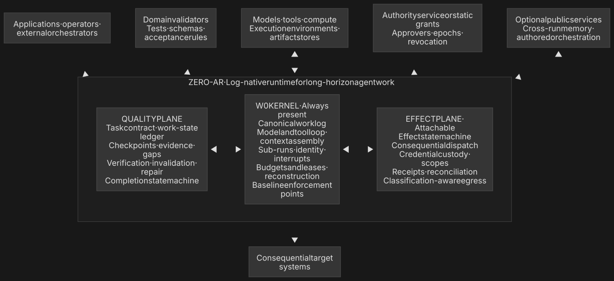

# ZERO-AR

### Zero-layer Autonomous Runtime

**The runtime beneath long-horizon work.**

Zero-AR turns autonomous work into a call: objective in, verified work out. Tell it what to do and what finished means. It keeps autonomous work attached to the objective, not to an agent session. Models and people can change while the objective, its history and its definition of done stay intact.

Agent demos end when an answer appears. Real work ends when the records balance, the evidence covers the claim, the exceptions are resolved and the person who owns the outcome can inspect what happened. Zero-AR continues until it returns a verified result, needs a decision, or states why it cannot finish.

## What verified means

`Verified` is a result class, not a model's claim that it is done and not a promise that every objective can be verified. Before work begins, the task contract maps each acceptance rule to an admitted validator or named human. The model does the work. It does not grade itself.

The finish line can be a business outcome rather than a passing test suite: every source record accounted for, totals balanced, exceptions resolved and required approvals or receipts recorded. The first-party validator catalogue and visible verification plan make common conditions reusable. A domain-specific condition can still require its own validator or named human decision. Missing coverage, rejection, failure, timeout or uncertainty cannot become verified.

Zero-AR does not decide what correct means. A weak validator can still check the wrong thing or always return pass. Labelled domain cases and observed false-pass and false-rejection rates are separate evidence.

Zero-AR is not a model, model host, sandbox, chat interface, workflow graph or general domain oracle. This kit does not grant effect authority or decide whether an outside action may occur.

## The name

Zero-AR expands to **Zero-layer Autonomous Runtime**. "Zero-layer" places the runtime beneath whichever model, agent framework, tool host or human expert does the work. "Autonomous Runtime" describes continuity toward an explicit objective, not unlimited authority. The product is unrelated to augmented reality or Apple ARKit. `ar-kit` is the name of this public Zero-AR developer kit.

**Developer release:** nine public packages are published to npm at version 0.2.1. This repository also carries the exact tested tarballs, emitted JavaScript, TypeScript declarations and the [OpenAPI 3.1 contract](./packages/client/openapi/zero-ar-v1.openapi.json). The runtime server and bundled Local Lite distribution are separate artifacts.

## Connect to a running endpoint

`ar-kit` is the public surface for building applications, authoring agents and validators, hosting tools, connecting through MCP and controlling Zero-AR work through the native API. Every SDK and command example below needs an already-running Zero-AR endpoint.

```js
import { createZeroAR } from '@zero-ar/sdk';

const zeroar = createZeroAR({
  endpoint: process.env.ZERO_AR_URL,
  apiKey: process.env.ZERO_AR_API_KEY,
});

const run = await zeroar.run({
  objective: 'Examine these records, investigate anomalies and stop only when the totals balance.',
  items: ['record-001', 'record-002', 'record-003'],
});

for await (const record of run.events()) {
  console.log(record.seq, record.type);
}

const result = await run.result();
console.log(result.verdict, result.artifact, result.not_established);
```

A process can discard this handle and recreate it later with `zeroar.attach(runId)`. The runtime owns the run state; the SDK does not keep a second copy.

## Install the developer surface

Node.js 24.11.0 through the Node 24.x LTS line is required. Install the SDK or command from npm:

```bash
npm install @zero-ar/sdk@0.2.1
npm install --global @zero-ar/cli@0.2.1

export ZERO_AR_URL=https://your-zero-ar.example
export ZERO_AR_API_KEY=your-tenant-key
zeroar run "Reconcile the open items and report what remains unverified"
```

The command is an API client. It requires a running hosted or Local Lite endpoint and never falls back after a hosted target has been selected. The application bearer key is separate from model, tool and effect credentials. Clone this repository when you need the source-bound tarballs and their provenance rather than the npm distribution.

## Choose an entry point

| Package | Use it to |
| --- | --- |
| [`@zero-ar/contracts`](./packages/contracts) | Share the schemas, identifiers, state machines and vocabulary of the runtime. |
| [`@zero-ar/client`](./packages/client) | Use the typed native API client or the versioned OpenAPI 3.1 contract. |
| [`@zero-ar/validator-kit`](./packages/validator-kit) | Author deterministic, grounding and classification validators. |
| [`@zero-ar/sdk`](./packages/sdk) | Author agents and embed durable run handles in an application. |
| [`@zero-ar/cli`](./apps/cli) | Start, inspect, control, resume, export and import work from the terminal. |
| [`@zero-ar/conformance`](./packages/conformance) | Check an execution-environment adapter against the public contract. |
| [`@zero-ar/tool-kit`](./packages/tool-kit) | Define and host tools against the public tool protocol. |
| [`@zero-ar/mcp`](./packages/mcp) | Expose reviewed work entrypoints and admit bounded MCP tools and resources. |
| [`@zero-ar/testkit`](./packages/testkit) | Exercise integrations with deterministic adapters and isolated scratch state. |

The typed client and the [OpenAPI 3.1 document](./packages/client/openapi/zero-ar-v1.openapi.json) come from the same route table. The SDK and CLI use that client rather than importing runtime or storage code.

## Runtime shape



The W0 Kernel owns the canonical work log, execution position, budgets, leases and reconstruction. The Quality Plane judges evidence against the task contract. The Public Alpha Effect Plane attachment records consequential-action proposals and refuses dispatch. Production authority, dispatch, receipts and reconciliation remain outside the Public Alpha claim. Models, tools and compute remain replaceable connected services.

## Completion and action boundaries

### 1. Who defines done?

Your task contract names every acceptance rule and the validator that covers it.

### 2. What does Zero-AR enforce?

The runtime refuses missing coverage, an unregistered or mismatched validator and heuristic-only sufficiency. Verified completion requires sufficient pass findings for every required rule.

### 3. What input does a validator receive?

A validator receives one rule, ordered ledger rows, their outputs and states, and the declared population total. The runtime computes a canonical hash over that complete admitted input and quarantines a host finding bound to another hash or item count.

### 4. Where does a validator run today?

The current development and first-beta host is a separate child process with no runtime append port, a registry-local working directory and a minimal environment. It is not the production sidecar boundary.

### 5. What happens when validation cannot conclude?

Absence, crash, timeout, cancellation, dependency failure or an input-manifest mismatch becomes infrastructure-indeterminate, never pass.

### 6. Can a weak validator establish a useful result?

Not by runtime mechanics alone. A validator can be deterministic and consistently wrong. Use positive, negative, indeterminate and adversarial labelled cases, then measure domain false-pass and false-rejection rates.

### 7. When is the Effect Plane required?

Read-only work may omit it. Consequential outside mutation requires an attached admitted plane. Public Alpha records a proposal and refuses dispatch; this kit exports no effect dispatcher or production target adapter.

Production validator admission still needs content-addressed executable identity, enforced repeatability, explicit full, sampled or oracle coverage, complete case admission, authenticated local IPC, read-only inputs, network denial and CPU, memory and PID limits.

## What this repository excludes

This is a source-free public distribution, not the Zero-AR server source tree. It contains no runtime server, storage implementation, provider credential, private package, test fixture or private repository history. Bundled Local Lite is distributed separately, and no command here installs or starts a public server.

MCP is an adapter over the native API. It does not become a second owner of run, quality, effect, artifact or cancellation state.

## Verify the release boundary

Every public tree is generated from one private source commit. The manifest records the digest of every exported file and every package tarball.

```bash
npm run verify
npm run exercise
```

`verify` checks the byte inventory and its binding to source commit `f1e0077e6a9840b52dd6b89a9d42755935e2b821`. `exercise` installs all nine tarballs in an isolated consumer, imports their public entrypoints, reads the OpenAPI contract and runs the packaged command. Neither command publishes anything. See [PROVENANCE.md](./PROVENANCE.md) for the complete boundary.

## License

Apache-2.0. See [LICENSE](./LICENSE) and [NOTICE](./NOTICE).
