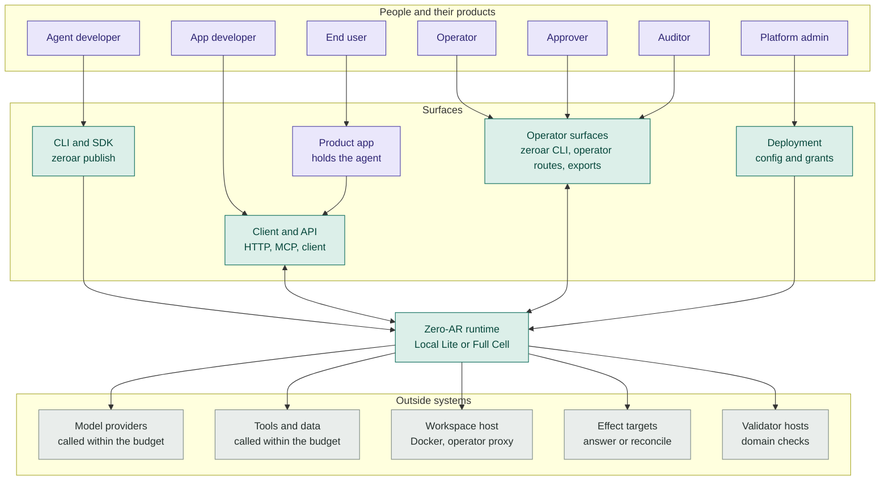

# How Zero-AR works

An AI job can outlast a model session. A person may add evidence, another may
approve an action, and the process may stop. Zero-AR keeps that work in one
run, with its history and current position intact. The agent calls the
selected models and tools within declared limits. A result receives the
status *verified* only when its named checks pass.

> This page describes Zero-AR version 0.4.1. It uses controlled English based
> on ASD-STE100, but it is not certified ASD-STE100. Commands and field names
> are in a monospace font.

## Terms

These words have specific meanings on this page.

| Term | Meaning |
|---|---|
| Run | One piece of work toward one goal, from its start to its result. A run continues across restarts, waits and changes of model or person. |
| Goal | The work that a run must do. An open goal has no task contract, so the agent writes its own plan and checks. |
| Accountable owner | The named person responsible for a run and its result. Publishing an agent does not by itself make someone its owner. |
| Task contract | Optional acceptance rules chosen by the accountable owner. Each rule names the check that decides it. |
| Budget | The limits of a run: model tokens, tool calls, bytes, compute time, human attention and model turns. |
| Work item | One part of a run's work. An application supplies the items for a contract run; an open-goal agent lists them in its plan. |
| Validator | A check that examines a result against a declared rule. |
| Effect | A change to an outside system, for example a sent message or a changed record. |
| Grant | A permission from a named approver. It lets one agent do one operation on one target until a stated time. |
| Receipt | The answer of an outside system that shows what happened to a sent effect. A proposal that was never sent has no receipt. |
| Workspace | A container for one run. It has a shell, files that stay for the full run, and a list of the network hosts it can reach. |
| Rebuild | Recreate the current state of a run from its history, without calling a model or tool again. |
| Replay | Start a new, linked run from the saved inputs of an earlier run. A replay calls models again, and effects are disabled in it. |
| Verified | The status of a result that passed its named checks. The status does not mean that the result is true in all conditions. |

## Where Zero-AR operates

Zero-AR has two deployments. The `zeroar` commands and the API are the same
for both.

| Deployment | For | Data store |
|---|---|---|
| Local Lite | One owner on one machine | SQLite |
| Full Cell | A hosted service with many tenants | PostgreSQL |

In each deployment, the W0 Kernel runs the work, the Quality Plane decides
whether the work is verified, and the optional Effect Plane holds the
authority to change outside systems.

## What version 0.4.1 includes

| Capability | What it does | Condition |
|---|---|---|
| Recovery without a person | After a restart, work in progress continues without an operator command. | A run that a person paused, or that waits for a person, continues to wait. |
| Open goals | An agent can write a plan, name its checks, do the work, repair it and propose completion without an owner task contract. | Zero-AR, not the agent, decides whether the named checks passed. |
| Workspace commands | `workspace.exec` runs commands in a container that belongs to the run. Its files stay for the full run. | The operator must configure a digest-pinned workspace image and Docker host capacity. |
| Reversible effect dispatch | A configured HTTP target can receive a reversible change under an active grant. Zero-AR reports the change as done only when the target gives a definite answer. | The target, the change, its reversal and the grants must all match. This does not enable general production effect dispatch. |
| Pause and budget addition | A person can pause a run and add budget to it. | Work in progress finishes before the pause. Resume is a separate command. |
| Fork with working state | A fork starts a new run that keeps the plan and the last saved workspace files. | Plan items start again in the new run. Files changed after the last save are not in the fork. Grants and credentials do not transfer. |
| Images to models | An admitted image or workspace screenshot goes to a model that accepts images. Other models receive a text note. | The number, size and cost of images stay within limits. |
| Browser workspace | A Chromium workspace gives the agent a `web` command in a real browser. | The browser image is a separate artifact. The operator must build it, publish it, pin its digest and configure it. |
| Large sources | An agent can work with sources that are too large for one model call, and it can open the exact passage that it needs. | The published agent must name a context policy. |
| Portable run bundles | An auditor can export a run and rebuild its current state without the server, its database or new model calls. | Protected workspace, memory and publication state needs separate authority to transfer. |
| Controlled continuation | A compatible destination can import a run and continue it one time. | The destination decides whether it is compatible. Import authority and resume authority are both necessary. |
| Operator validators and questions | A Full Cell can run the validators of an operator outside the runtime. A validator can ask a person a question about one item during the work. | The publication names the validators. It does not upload validator code. |
| Web search and page fetch | `web.search` sends up to three queries to one search provider at the same time. `web.fetch` reads one page and keeps it as a Markdown artifact that expires. | Local Lite needs a configured provider and its key, from the Keychain or an environment variable. A hosted tenant needs a configured `web_search` block. The run history keeps no query text and no page text. |

## Who uses Zero-AR

Seven types of person use Zero-AR. Most end users never see it. They use a
product, and the product uses Zero-AR.

| Person | What they do | Surface |
|---|---|---|
| End user | Uses the product that contains the agent. | The product |
| Agent developer | Defines an agent and publishes it for hosted use. | `zeroar publish` and the TypeScript SDK |
| Application developer | Starts runs from a product and reads the results. | The client, the HTTP API or the MCP server |
| Operator | Watches runs. Steers, pauses, redirects, answers and cancels them, adds budget, and forks a run. | The `zeroar` CLI and the operator routes |
| Approver | Approves or refuses one exact effect. | The effect decision route |
| Auditor | Exports or imports a run and rebuilds its state without doing the work again. Can start a separate replay for comparison, which calls models again. Reads records, receipts and check results. | `zeroar export`, `import`, `records` and `replay` |
| Platform administrator | Deploys Zero-AR. Sets the tenants, providers, grants, workspace image and limits. | The deployment configuration |

The accountable owner is a person named on the run, not another product
surface. An agent developer can publish the contract of the owner without
being that owner.

**Figure 1.** Who uses Zero-AR, and through which surface. Requests go down.
Status and results come back up on the arrows with two heads. A sent effect
also returns a receipt when its target gives a definite answer. An end user
reaches Zero-AR only through a product.

## What a run guarantees

- A run does not start a model or tool call that its remaining budget cannot
  cover.
- The agent cannot give its own work the status *verified*. The named checks
  decide.
- A change to an outside system needs a matching grant. Zero-AR reports the
  change as done only when it has a receipt.
- An unknown outcome stays visible, and it prevents verified completion until
  someone resolves it.
- After a restart, the work continues without a person.
- A person can steer, pause or cancel a run at any time, and can answer each
  question that the agent asks.

## What Zero-AR does when a problem occurs

Zero-AR tries to continue without a person. When it cannot, it suspends the
run and records the reason.

| Problem | What Zero-AR does |
|---|---|
| A model provider does not answer. | Zero-AR tries again, with a longer wait before each try. If the provider still does not answer, the run suspends until a person resumes it. |
| The agent makes no progress. | The agent reviews its own work. If that does not help, the run suspends and gives the reason. A person can steer or redirect, then resume. |
| The budget is empty. | The call does not start. The run suspends and gives the reason. A person can add budget, then resume the run. |
| An answer needs human attention budget, but none is left. | Zero-AR refuses the answer before it records it, and the item continues to wait. An authorized operator can add attention budget and send the answer again. |
| The agent asks a question. | The run suspends until a person answers. |
| The authority service does not answer. | Zero-AR does not send the effect. Nothing goes to the outside system. |
| An effect may have been sent, but the target does not answer. | Zero-AR records an unknown outcome. It does not claim a receipt, and it does not send the effect again until it finds out what the target did. An unknown outcome prevents verified completion. |
| The process stops. | On restart, Zero-AR recovers the state of each run and continues the work in progress. A run that a person paused, or that waits for a person, continues to wait. |
| The process stops while Zero-AR saves a workspace. | Zero-AR repairs the workspace before a run uses it again. If the repair fails, Zero-AR refuses to attach the workspace and gives the reason. |

## What a person can do during a run

A person can send these commands at any time. Only `cancel` ends the run.

| Command | Result |
|---|---|
| `steer` | Adds direction. The agent reads it before its next step, and the run continues. |
| `pause` | Suspends the run before the next step of the agent, or at once if the run is already suspended. The step in progress finishes first. Only a person's `resume` continues the run. |
| `redirect` | Stops the current step. The run continues in the new direction. |
| `answer` | Answers a question from the agent. |
| `resume` | Continues a suspended run. |
| `cancel` | Ends the run. Zero-AR closes the work that is still open first. |
| `budget` | Adds model tokens, tool calls, bytes, compute time, human attention or model turns to a run that has not ended. A run that ran out of budget continues after `resume`. |
| `fork` | Starts a new run from a point in the history of an earlier run, with new budgets if you send them. The fork keeps the history up to that point, the plan with every item started again, and the last saved workspace. |
| Effect decision | Approves or refuses one exact effect that waits for a person. |
| `inspect`, `records`, `result` | Show the current state, the records and the result. |

A `resume-deferred` sent after a `pause` gives a pause that ends at a set
time. A pause never stops work in progress. To stop the current step now, use
`redirect` or `cancel`.

## What Zero-AR does not replace

- Model providers.
- A planner for many separate goals. One run has one goal.
- A workflow engine for business processes.
- An identity provider or a secret store.
- The outside systems where effects occur.

## Known limits in 0.4.1

- Controls and budget additions record the application that sent them, not
  the end user it acted for.
- A fork of a run that is still in progress starts from the last saved
  workspace of that run, which can be older than its live files.
- The egress proxy of the operator enforces the workspace network allowlist.
  Zero-AR checks that the workspace network is internal, but it does not
  check which hosts the proxy lets through.
- The workspace runs on Docker only.
- General production effect dispatch is not enabled. Version 0.4.1 includes a
  reversible HTTP target whose exact change, reversal and active grants must
  match.
- The browser workspace is a separate reference image. An operator must build
  it, pin its digest and configure it.
- A tool that cannot state a limit for its own bytes or compute time can use
  more of them than the budget allows. Zero-AR reports that the use of that
  tool is not fully bounded.
- A run exported from one Full Cell continues in another only when the two
  cells share one continuation authority, which no shipped configuration sets
  up yet. A standalone Full Cell refuses a run from another cell and says why.
  Version 0.4.2 is to add a handoff that needs no shared authority.
- Some behavior is in the code but not yet proven through a shipped
  deployment. One example is artifact provenance through a real environment.
- The hosted Full Cell does not yet record environment cost totals.

---

This page describes Zero-AR version 0.4.1. It describes what Zero-AR does and
what it guarantees. The commands and names on this page are those of the
public API and the `zeroar` command.
